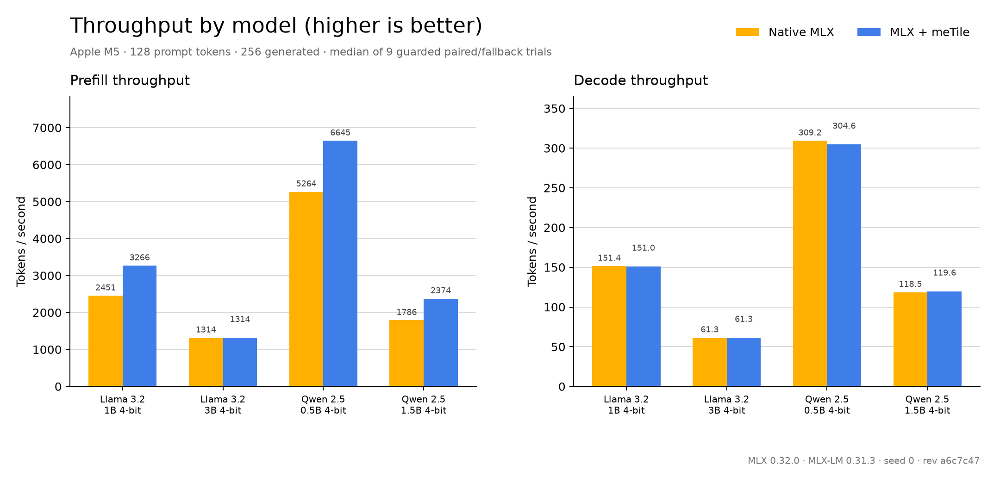
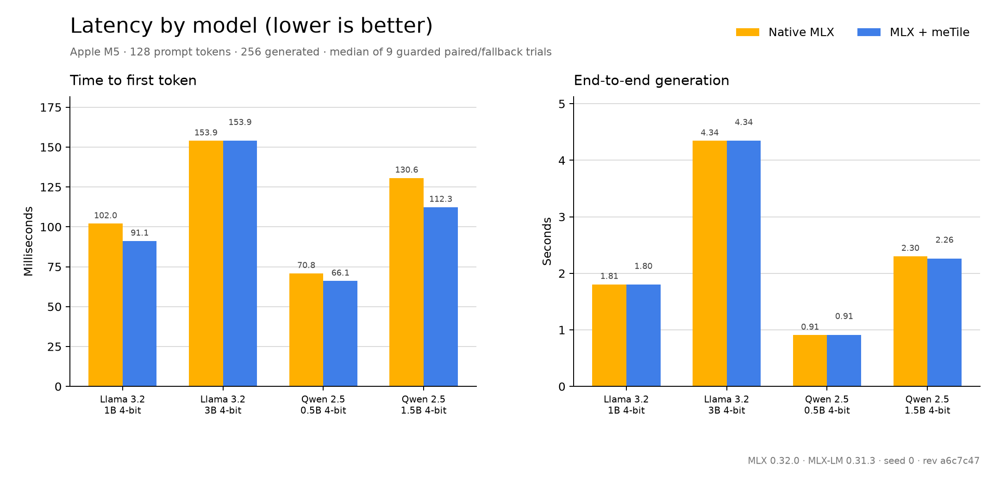
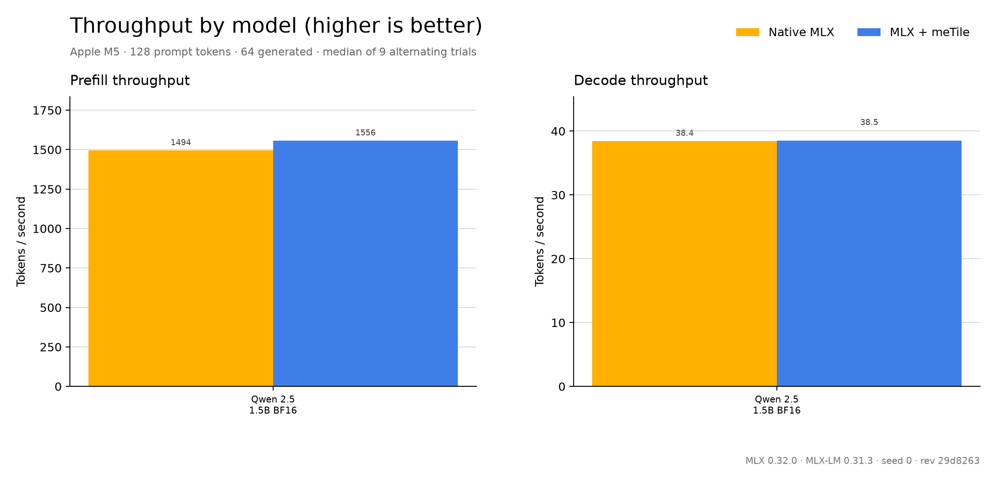
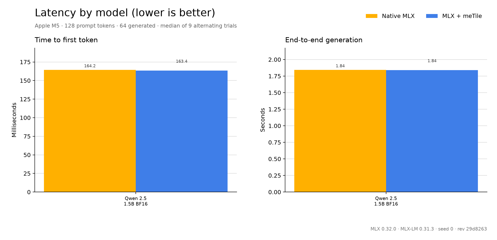
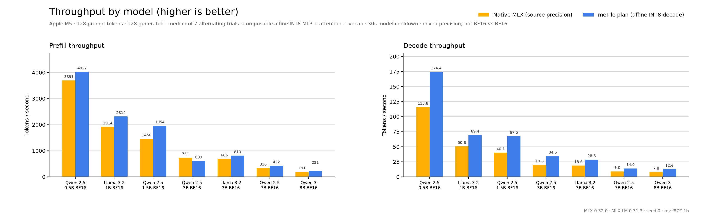
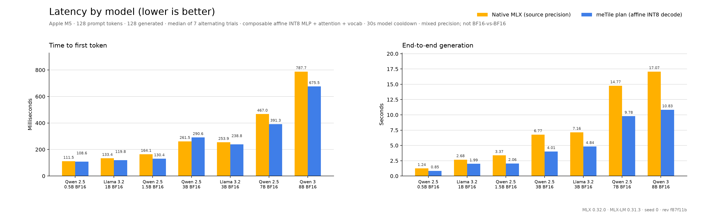
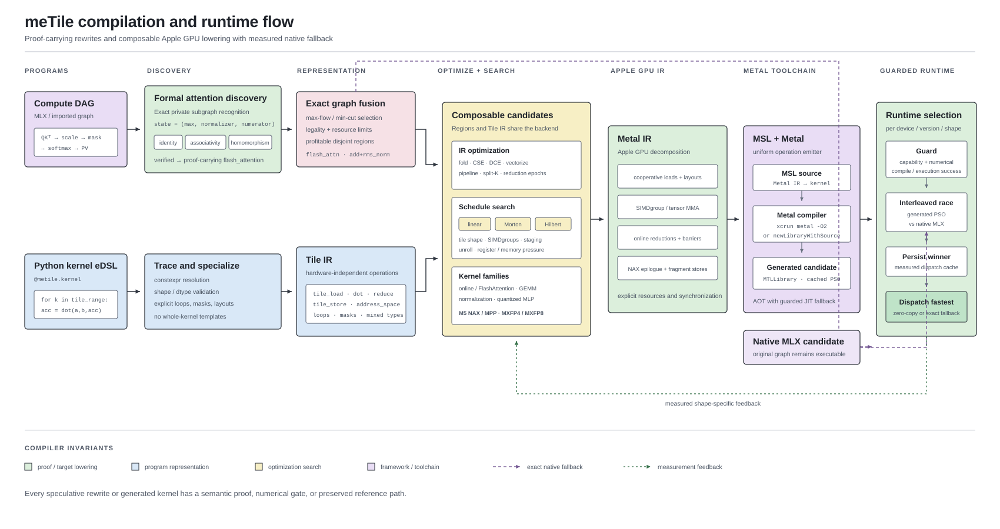

# meTile

Tile-based eDSL and compiler for Apple GPUs. Write tile programs in Python, compile to Metal.

```
@metile.kernel (Python eDSL)
    - Tile IR (hardware-agnostic)
    - Metal IR (simdgroup mappings, threadgroup memory)
    - MSL codegen
    - xcrun metal -O2 (precompiled metallib)
    - dispatch via ctypes Metal bridge
```

## Example: GEMM

```python
@metile.kernel
def gemm(A, B, C, M, N, K,
         BLOCK_M: metile.constexpr, BLOCK_N: metile.constexpr,
         BLOCK_K: metile.constexpr):
    pid_m = metile.program_id(0)
    pid_n = metile.program_id(1)
    acc = metile.zeros((BLOCK_M, BLOCK_N), dtype="f32")
    for k in metile.tile_range(0, K, BLOCK_K):
        a = metile.tile_load(A, pid_m * BLOCK_M, k, K, (BLOCK_M, BLOCK_K))
        b = metile.tile_load(B, k, pid_n * BLOCK_N, N, (BLOCK_K, BLOCK_N))
        acc = metile.dot(a, b, acc)
    metile.tile_store(C, pid_m * BLOCK_M, pid_n * BLOCK_N, N, acc, (BLOCK_M, BLOCK_N))
```

## Example: Softmax

```python
@metile.kernel
def softmax(X, Out, N, BLOCK: metile.constexpr):
    row = metile.program_id(0)
    m = -1e38
    for i in metile.tile_range(0, N, BLOCK):
        cols = i + metile.arange(0, BLOCK)
        mask = cols < N
        x = metile.load(X + row * N + cols, mask=mask)
        m = metile.maximum(m, x)
    m = metile.max(m)

    s = 0.0
    for i in metile.tile_range(0, N, BLOCK):
        cols = i + metile.arange(0, BLOCK)
        mask = cols < N
        x = metile.load(X + row * N + cols, mask=mask)
        s = s + metile.exp(x - m)
    s = metile.sum(s)

    for i in metile.tile_range(0, N, BLOCK):
        cols = i + metile.arange(0, BLOCK)
        mask = cols < N
        x = metile.load(X + row * N + cols, mask=mask)
        metile.store(Out + row * N + cols, metile.exp(x - m) / s, mask=mask)
```

## Features

**eDSL & Frontend**
- Python-based eDSL: `@metile.kernel`, `program_id`, `arange`, `load`/`store`, `dot`, `tile_load`/`tile_store`
- Explicit `cast` operations keep mixed-precision accumulation and storage choices visible in Tile IR.
- Explicit loop-carried scalar SSA values plus native `simd_sum`, `simd_max`, and `fast_exp` primitives for composable online algorithms
- Autotuner (`@metile.autotune`) with config search over block sizes, SG counts, execution modes, and tile schedules

**Compiler**
- Multi-level IR pipeline: Tile IR (hardware-agnostic) &rarr; Metal IR (decomposed primitives) &rarr; MSL
- CuTe-inspired layout algebra with hierarchical Shape:Stride, composition, complement, and logical divide. Supports arbitrary tile shapes.
- Composable optimization passes that transform IR structure: shared memory padding / XOR swizzle, split-K, vectorized loads, serpentine MMA traversal, preloaded tiles, double-buffered K-loop, block swizzle for L2 locality
- Schedule-algebra pass over finite tile permutations. Generator closure derives the shape-preserving D4, D2, C2, or trivial action; orbit representatives remove equivalent traversals before emitting branch-free linear, grouped-2/4/8, diagonal, Morton, or 4x4 Hilbert schedules.
- Schedule decoders are composable scalar-expression programs, not whole-kernel templates. Extraction strength-reduces exact constant divisions and chooses target-operation cost first, then compressed canonical-program length as a computable minimum-description-length upper bound.
- Runtime remains the primary objective across kernel candidates. Compressed generated MSL only breaks measured latency ties within 0.25% of the fastest representation.
- Proof-carrying reduction discovery models candidate algorithms as finite summary monoids. A restricted equational verifier checks identity, generated associativity, and list-homomorphism obligations before graph rewrites may use sum, max, or stable weighted-softmax states.
- Exact attention discovery recognizes private `softmax(scale(Q @ K.T)) @ V` DAG regions, proves the online `(maximum, normalizer, numerator)` state, and replaces the materializing chain with one `flash_attention` operation.
- Composable MXFP4/MXFP8 Metal IR operations for vectorized fused decode, optional threadgroup staging, register-resident NAX fragments, MPP matrix multiply, and stores.
- NAX setup/run/epilogue/store lowering decomposes into tile-layout, vector-load, cooperative-tensor pack, MMA, per-fragment apply, and fragment-store IR. Shape-tuned reduction epochs can preload adjacent K fragments without owning a whole kernel template.
- Autotuned fused epilogues (ReLU, GELU, SiLU, exp, scale) run directly on cooperative-tensor or NAX register fragments with zero intermediate global memory traffic.

**Codegen**
- Simdgroup matrix (8x8) MMA with decomposed load / MMA / store primitives
- Native unsigned `reverse_bits` lowering for branch-free permutation decoders
- Metal 4 tensor_ops (`matmul2d`) with runtime GPU-family and toolchain checks; the M5 path supports preemptive, cooperative, and direct register-fragment execution
- Per-kernel `max_total_threads_per_threadgroup` specialization and shared op-by-op emission instead of monolithic whole-kernel templates
- AOT compilation via `xcrun metal -O2` with JIT fallback (`newLibraryWithSource`) when Xcode is unavailable

**Runtime**
- Zero-copy unified memory via `metile.Buffer`. CPU and GPU share the same physical memory.
- Interleaved round-robin autotuning uses synchronized end-to-end latency for sub-millisecond kernels and GPU timestamps for sustained workloads, with launch-grid-, shape-, device-, and toolchain-keyed persistent config, measured-latency, and metallib caches.
- Online decode attention is composed from ordinary eDSL kernels. The runtime measures single-pass 2/4/8/16/32-SIMDgroup schedules and long-context two-pass token partitions per head count, context length, and head dimension.
- Automatic dense and block-scaled tile/schedule dispatch across grouped, Morton, Hilbert, staged, and register-resident candidates, including 2- and 4-SIMDgroup MXFP tiles.
- Batched FFT dispatch searches threadgroup width, register-local radix decomposition, bit-reversal placement, and twiddle placement per transform shape instead of selecting a monolithic kernel template.
- Aligned NAX kernels specialize dimensions and bind only matrix buffers on the prepared hot path; reduction epoch and K-fragment preload choices remain runtime-tuned per shape.
- Prepared calls bulk-bind buffers, reuse unchanged encoder state, batch compatible launches, and expose `repeat(count)` to encode repeated work under one lock; measured short kernels receive an adaptive bounded poll-before-sleep budget while longer workloads block immediately.
- Pure Python runtime. meTile has a ctypes Metal bridge with no PyObjC dependency.
- Optional zero-copy MLX graph primitives and a reversible MLX-LM patch select between generated meTile kernels and native MLX per shape, including bit-exact BF16 dense gate/up/SwiGLU fusion, fused affine-quantized SwiGLU, and down-projection/residual decode candidates.
- Discovered FlashAttention regions race native MLX against causal/noncausal row-tiled online kernels and persist only compatible winners that clear the 5% framework boundary.

## Block-Scaled GEMM

MXFP4 and MXFP8 weights use 32-value groups with E8M0 scales. The compiler fuses
dequantization into the same Metal 4 MPP kernel instead of materializing a dense weight:

```python
a = metile.Buffer(data=np.random.randn(128, 1024).astype(np.float32))
w = metile.BlockScaledWeight.quantize(weight, format="mxfp4")  # weight is K x N

out = metile.block_scaled_matmul(a, w)
```

The aligned fast path currently requires `M`/`N` multiples of 64 and `K` a multiple
of 32. `prepare_block_scaled_matmul` autotunes staged and direct register-fragment
representations, including paired K steps that reuse E8M0 scale fragments and 32x64
two-SIMDgroup output tiles, and returns a reusable hot-path dispatcher.

## Decode Attention

The decode kernels keep query values and online-softmax state in registers and merge
SIMDgroup partials without materializing an attention matrix. For long contexts, the
runtime also measures a multi-threadgroup first pass and a second online merge:

```python
from kernels import attention_decode

dispatch = attention_decode[(batch, query_heads)].prepare(
    query,
    key,
    value,
    output,
    context_length,
    head_dim**-0.5,
    D=head_dim,
    KV_HEADS=key_value_heads,
)
dispatch()
```

The public kernel accepts contiguous float32 MHA/GQA/MQA tensors flattened as query/output
``[batch, query_heads, D]`` and key/value ``[batch, key_value_heads, tokens, D]``, with
``query_heads`` divisible by ``key_value_heads`` and ``D`` divisible by 32. The original
one-dimensional ``(heads,)`` launch remains a batch-one MHA shorthand.

## FlashAttention Discovery

The high-level compute DAG can express ordinary matmul, scale, causal-mask, and
softmax nodes without prescribing a kernel boundary. Before backend fusion, the
compiler finds exact attention chains whose score/probability intermediates do not
escape. It then discharges an equational proof over the stable weighted-softmax
summary and emits one proof-carrying `flash_attention` node. Invalid merge equations,
wrong reduction axes, incompatible shapes, and escaping intermediates reject the
rewrite.

The generated Metal candidate assigns one query row per threadgroup, streams K/V
without materializing the score matrix, and merges SIMDgroup-local online states.
It supports aligned causal masks and MHA/GQA shapes with head dimensions divisible by
32. Native MLX is still a candidate, numerical compatibility is checked first, and a
31-round finalist tournament requires 5% headroom before switching. This follows the
exact online-normalizer construction and IO-aware attention decomposition described by
[Milakov and Gimelshein](https://arxiv.org/abs/1805.02867) and
[Dao et al.](https://arxiv.org/abs/2205.14135), but does not assume an NVIDIA warp or
CUDA-specific whole-kernel template.

```bash
python benchmarks/flash_attention_discovery.py --trials 31
```

## Automatic Gated Epilogue Fusion

The graph optimizer recognizes `matmul(x, W_gate)`, `matmul(x, W_up)`,
`silu(gate) * up`, and the consuming down projection as a declarative
`ParallelEpilogueRule`. It rejects escaping intermediates and target-resource violations,
then lets each backend choose its own lowering rather than instantiating a whole MLP template.

For affine 4-bit weights, the Metal runtime now tunes a scratch-spilled schedule alongside
native MLX, compiled MLX, and register-fused meTile. Gate accumulators are reduced into
threadgroup memory before up accumulators become live; after a barrier, SwiGLU consumes the
on-chip values. The native M5 path uses the same lifetime split between `matmul2d` fragment
reductions, reuses two accumulator vectors, and transposes lane/element scratch indices to avoid
32-bank conflicts. Both schedules remain guarded autotune candidates, so losing shapes preserve
MLX. L2 reuse for the immediately following down projection is a scheduling opportunity, not a
cache-pinning guarantee on Metal.

The decode backend also composes the selected gate/up implementation with a down-projection
epilogue that adds the transformer residual before the result leaves the kernel. Its schedule
tournament covers eager and compiled MLX plus generated block width, outputs per SIMD-group,
and FP16/FP32 decode choices. A warmed, shape-specialized MLP executor binds the winning
weights and kernels once, avoiding repeated Python dispatch construction without turning the
MLP into a monolithic compiler template.

## MLX-LM Backend

meTile-generated Metal can execute as a lazy, zero-copy MLX primitive. The integration
uses a Liger-style opt-in patch with independent attention, RMSNorm, graph-fusion,
and quantized-MLP switches:

```python
from mlx_lm import load
from metile.integrations.mlx_lm import (
    apply_metile_to_mlx_lm,
    autotune_metile_for_mlx_lm,
    prepare_mlx_lm_affine_prefill,
    prepare_mlx_lm_compressed_attention,
    prepare_mlx_lm_compressed_down,
    prepare_mlx_lm_compressed_gate_up,
    prepare_mlx_lm_compressed_vocab,
    prepare_mlx_lm_dense_mlp,
)

model, tokenizer = load("mlx-community/Llama-3.2-1B-Instruct-4bit")
affine_prefill = prepare_mlx_lm_affine_prefill(model)
patch = apply_metile_to_mlx_lm(model=model, affine_prefill=affine_prefill)

# Restore every patched function or use the handle as a context manager.
patch.restore()
```

Dense BF16/FP16 checkpoints use the same reversible structure:

```python
model, tokenizer = load("mlx-community/Qwen2.5-1.5B-Instruct-bf16")
dense_mlp = prepare_mlx_lm_dense_mlp(model)
patch = apply_metile_to_mlx_lm(model=model, dense_mlp=dense_mlp)
```

For an opt-in high-fidelity decode path, the model tuner can AOT-quantize only dense
down projections to affine INT8 while retaining every BF16 weight as the native fallback:

```python
import mlx.core as mx

compressed_down = prepare_mlx_lm_compressed_down(model, format="affine8")
compressed_gate_up = prepare_mlx_lm_compressed_gate_up(model)
compressed_vocab = prepare_mlx_lm_compressed_vocab(model)
compressed_attention = prepare_mlx_lm_compressed_attention(model)
sample_tokens = mx.array([tokenizer.encode("Explain tiled matrix multiplication.")])
plan = autotune_metile_for_mlx_lm(
    model,
    sample_tokens,
    quantized_mlp=False,
    compressed_down=compressed_down,
    compressed_gate_up=compressed_gate_up,
    compressed_vocab=compressed_vocab,
    compressed_attention=compressed_attention,
)
patch = apply_metile_to_mlx_lm(
    model=model,
    compressed_down=compressed_down,
    compressed_gate_up=compressed_gate_up,
    compressed_vocab=compressed_vocab,
    compressed_attention=compressed_attention,
    plan=plan,
)
```

This path is not bit-exact: selection requires the same next token plus strict KL and logit-error
bounds. MXFP8 down projection is available only with an explicit approximation opt-in. Multi-row
prefill always executes the original BF16 block. Before timing, cache-aware calibration uses an
8-step exponential/binary search with bounded non-monotonic boundary audits, then requires the
winner to pass a 32-step holdout and audits the largest full-horizon regions again. Sensitive projections stay in BF16, while the surviving
affine-INT8 mask is patched directly onto its ``down_proj`` instances.
The low-description-length mask persists by model, calibration tokens, device, MLX version,
format, and backend source identity. Affine group size defaults to `"auto"`: the AOT tuner
races every dimension-compatible group among 32, 64, and 128 on the actual one-row projection
shape, rotates measurement order, and averages four synchronized dispatches per sample. The
micro-tuner seeds bandwidth-dominated MLP and vocabulary families with peak throughput and
attention with the lowest-error group within 2.5% of peak speed. Layer-grouped gate/up and
attention candidates then calibrate every group sequentially and minimize their predicted mixed
cost: surviving compressed layers use the measured affine-INT8 time while sensitive fallback
layers use the measured native BF16 time. The model/prompt/device/shape decision persists with
MLX and backend-source identities. MXFP8 stays
an explicit approximate option rather than participating in this strict tournament.

Gate/up compression is a separate layer-grouped plan feature. Its calibration keeps each SwiGLU
gate/up pair together, while down-projection calibration remains independent. The compute-graph
planner therefore measures native MLX, gate/up-only, down-only, and their composition instead of
hard-coding a full MLP template. Multi-row calls always retain native BF16. On Qwen 3 8B, all 36
gate/up pairs and all 36 attention layers selected affine group 128 and composed with vocabulary
compression. Seven measurement pairs recorded 1.601x decode and 1.604x end-to-end; every
confirmation decode pair exceeded 1.44x. Raw samples and guards are in
`benchmarks/results/m5-mlx-lm-bf16-models.json`.

Vocabulary compression is another independent plan feature. It patches either a tied embedding's
``as_linear`` projection or an untied ``lm_head`` only for one-row decode; embedding lookup and
multi-row prefill remain native. The same strict token/KL/logit policy and model-level tournament
decide whether it composes with gate/up, down, both, or neither.

Attention-projection compression groups ``q_proj``, ``k_proj``, ``v_proj``, and ``o_proj`` by
transformer layer, preserves projection biases, and patches only one-row decode. The model tuner
composes it independently with MLP and vocabulary candidates. On Qwen 2.5 3B, strict calibration
selected 34 attention layers at affine group 32 alongside 34 down and 33 gate/up layers.

The dispatcher benchmarks native MLX alongside generated blocks. Attention and RMSNorm
require at least 5% primitive-level headroom before crossing the framework boundary;
otherwise the call stays on MLX. A high-level compute DAG also discovers multi-output
residual-add/RMSNorm fusion using an exact max-flow/min-cut pass and a stricter 10% switch
margin. Unsupported attention modes, masks, sinks, quantized KV caches, and dtypes fall
back exactly. Attention and RMSNorm support BF16/FP16/FP32 and accumulate in FP32.

Fusion candidates that overlap form a weighted conflict graph. The compiler decomposes it
and solves every bipartite component globally through the exact min-cut reduction for
maximum-weight independent set, avoiding greedy choices that can discard a more profitable
pair of regions. General non-bipartite set-packing components retain a deterministic legal
fallback because they are not representable by one s-t cut.

For affine 4-bit model weights, AOT preparation preserves the original quantized values while
transposing packed nibbles and scale/bias groups into a K-major NAX view. Ragged prefill rows
then tune native MLX against generated 32-, 64-, and 128-row NAX workgroups with Morton,
grouped, Hilbert, and linear schedules. Both tile axes are runtime decisions, and ragged row
loads and stores remain masked. Only prepared projection instances change class, so unrelated
linear layers keep the exact MLX path and
decode remains independently eligible for the guarded down/residual path in canonical Llama
and Qwen2 blocks. Unsupported or multi-row calls immediately use the original block, while a
warmed decode executor bypasses repeated compatibility and kernel-construction work. Model
plans require matching next tokens, bounded KL divergence, bounded mean/max logit error, a
measured TTFT, end-to-end, or sustained decode win, and bounded decode/total behavior.
Plans capable of changing prefill keep the stricter 0.5% TTFT confirmation floor. A decode win
requires at least 1% median throughput, wins in at least two-thirds of paired trials, and passing
the applicable TTFT and total-regression checks. Self-deoptimizing prefill-only plans use a 1%
decode noise floor.
Generated model-plan winners are retested jointly on a separate holdout with at least 32 decode
steps and seven paired trials before the plan is cached. The holdout preserves measured MDL and
decode leaders, the maximal compatible compression plan, and a greedy ladder composed from the
fastest compression basis features. Search uses coverage-preserving successive halving: every
legal composition receives one timing round, at most eight broad metric leaders advance to three
rounds, and only the resulting finalists advance to five. When the long-horizon shortlist exceeds
three plans, every finalist first receives three 32-step trials before the native baseline and top
two leaders complete seven. Stages reuse one prepared native autoregressive trajectory and do not
repeat fidelity checks for a candidate that already passed in the same search. Candidate timing
therefore explores the complete composition lattice without paying the full trial count for every
plan. Because the compressed patches are unreachable during multi-row
prefill, decode-only plans rank on decode and total latency rather than unrelated prompt-TTFT
noise. Complete-generation confirmation therefore applies the 0.5% TTFT floor only to plans
capable of changing prefill; decode-only plans must still win paired decode or total measurements
and pass the end-to-end regression floors. A failed holdout is retried twice before the runtime
falls back.
Eligible projection calibration first finds prefix and suffix fidelity boundaries logarithmically,
then spends a fixed 16-evaluation budget growing the winner into a non-contiguous subset. Attention
retains its interval mask because standalone-maximal attention subsets can block faster multi-feature
compositions. Each interval direction is capped at 13 probes, and full-horizon validation revisits
only the top boundary and a local four-layer window before a conservative fallback. This admits
safe non-contiguous projections without making search exponential.

Dense preparation retains MLX's output-major weights and creates K-major gate/up views only
when the projected working set stays below 80% of MLX's recommended limit. When the same guard
also permits an interleaved ``[N, K, 2]`` gate/up view, one-row decode races exact output-major
SIMD-group QMV schedules that reproduce MLX's four-value lane partition and shuffle-down
reduction order. The compiler shares activation fragments across both dot products and applies
the typed SwiGLU epilogue before its only output write. The schedule lattice covers one, two, and
four outputs per SIMD-group; one, two, four, and eight SIMD-groups per threadgroup; and one- or
two-block K unrolling. Unrolled schedules retain the original lane partition and reduction order,
including an aligned tail for odd block counts. Candidates must be bit-exact against MLX and at
least 1.5% faster in the main tournament and a separate 127-round holdout before dispatch can
select them.

Decode-only affine-INT8 families are staged sequentially under a separate 90% ceiling so larger
compositions can fit without crossing MLX's recommended working-set limit. Calibration may keep
only a prefix or suffix of layers, and unsupported or fidelity-sensitive projections remain BF16.

The selected gate/up result then feeds a separately composable exact down-projection QMV. Its
typed store adds the transformer residual without materializing the unfused projection result.
The runtime races one, two, and four SIMD-groups per threadgroup against native
``values @ weight.T + residual`` and requires bit equality plus 1.5% primitive headroom.
Gate/up dispatch and the down/residual block rewrite are independent model-plan features, so a
prefill or paired-QMV win is not suppressed by a neutral residual schedule, and vice versa.
Residual-only plans execute the model's original gate/up projections before the exact generated
store, preventing an unselected gate/up schedule from leaking into the measurement.

Multi-row calls race the two composable NAX projections and fused dual-GEMM lowering. The fused
path keeps both accumulators register-resident and applies SwiGLU before the tile is stored. BF16
sigmoid, SiLU, and multiply boundaries mirror MLX's typed Metal functor, so it is bit-exact rather
than merely tolerance-compatible. The model tuner races every representation against native MLX;
the runtime retains native execution whenever a primitive or complete model plan misses its guard.

The optional MLX primitive backend also accepts MXFP4 and MXFP8 K-major weights. It emits
register-fragment block-scale decode plus NAX ``matmul2d`` directly into the MLX lazy graph,
autotunes linear, grouped, Morton, Hilbert, and occupancy-oriented tile representations, and
keeps MLX arrays as the only storage. Each prepared weight also retains MLX's native packed
view, so the same tournament can fall back exactly when the fastest generated kernel does not
clear a ten-percent framework margin. Run the paired in-graph benchmark with
``python benchmarks/block_scaled_gemm.py 2048``; the selected algorithm and schedule are
printed with both synchronized medians.

The committed M5 32 GB suite uses MLX 0.32.0, MLX-LM 0.31.3, a 128-token prompt,
256 generated tokens, five end-to-end confirmation pairs, and nine continuous measurement
pairs. It verifies bounded logit fidelity, tunes the complete model plan, and confirms it on
the full generation workload before measurement. When no optimized plan clears the TTFT,
decode, and end-to-end safety bars, both labels share the same native measurement instead of
presenting system noise as a speedup:

| Prefill and decode throughput | TTFT and end-to-end latency |
|:--:|:--:|
|  |  |

| Model | MLX decode | MLX + meTile | Native TTFT | Decode | Prefill | TTFT | End-to-end |
|---|---:|---:|---:|---:|---:|---:|---:|
| Llama 3.2 1B 4-bit | 151.36 tok/s | 150.98 tok/s | 102.0 ms | 0.998x | 1.339x | 1.135x | 1.004x |
| Llama 3.2 3B 4-bit | 61.35 tok/s | 61.35 tok/s | 153.9 ms | 1.000x | 1.000x | 1.000x | 1.000x |
| Qwen 2.5 0.5B 4-bit | 309.19 tok/s | 304.62 tok/s | 70.8 ms | 0.994x | 1.275x | 1.072x | 1.001x |
| Qwen 2.5 1.5B 4-bit | 118.54 tok/s | 119.65 tok/s | 130.6 ms | 1.001x | 1.331x | 1.170x | 1.013x |

Three workloads selected the generated affine-prefill path; Llama 3.2 3B retained native
MLX. Speedups are medians of paired ratios, while chart bars show absolute medians. Raw trials,
confirmation pairs, environment metadata, fidelity metrics, comparison mode, and selected
dispatches are in `benchmarks/results/m5-mlx-lm-models.json`. Reproduce the suite and regenerate
the PNG bar charts:

```bash
python benchmarks/mlx_lm_suite.py \
  --prompt-tokens 128 --generation-tokens 256 --trials 9 --delay 0 \
  --plan-trials 7 --confirmation-trials 5 \
  --output benchmarks/results/m5-mlx-lm-models.json

python benchmarks/render_mlx_lm_results.py \
  benchmarks/results/m5-mlx-lm-models.json
```

### Benchmark Precision Classes

Model results are reported in three distinct classes: same weight representation, matched
quantization on both backends, and compiler-selected mixed precision. Only the first two are
apples-to-apples kernel comparisons. The focused fused result below is exact BF16 versus BF16.
The seven-model capacity suite is a mixed-precision deployment comparison: native MLX reads the
source BF16 weights, while the selected meTile plan uses separately prepared affine-INT8 copies
for chosen one-row decode projections. No matched affine-INT8 control suite is committed yet, so
the capacity gains must not be presented as evidence that generated BF16 kernels beat native MLX.

New schema-19 benchmark records encode this distinction in `precision_comparison`, and the chart
renderer rejects inconsistent precision metadata instead of silently assigning a comparison class.

### Matched Primitive Checkpoints

Two isolated Qwen 2.5 0.5B layer-0 SwiGLU checkpoints compare the same weight representation on
both sides. They validate kernel dispatch, not end-to-end model speed:

| Representation | Native MLX | meTile | Speedup | Fidelity |
|---|---:|---:|---:|---|
| BF16 | 357.75 us | 350.79 us | 1.020x | Bitwise exact |
| Affine INT8, group 64 | 273.90 us | 267.35 us | 1.024x | Mean 0.000348, max 0.007813 |

The BF16 winner is a generated paired SIMD-group QMV with two-block K unrolling. The affine-INT8
winner uses identical packed group-64 weights for native `mx.quantized_matmul` and generated meTile.
In the real autoregressive model context, a fused compressed gate/up implementation measured
10.39 ms versus 9.38 ms for the projected implementation, so the runtime correctly retained the
faster projected path rather than promoting the isolated-kernel result.

Raw records are in `benchmarks/results/m5-dense-bf16-swiglu-qwen05.json` and
`benchmarks/results/m5-affine8-swiglu-qwen05.json`. Reproduce them with
`python benchmarks/dense_bf16_swiglu.py` and `python benchmarks/affine8_swiglu.py`.

### Exact BF16 Benchmark

The focused Qwen 2.5 1.5B run selected the exact fused dense plan. Nine alternating measurement
pairs improved prefill throughput from 1493.93 to 1555.80 tok/s (1.060x paired) while decode,
TTFT, and total time remained effectively neutral. The preceding nine-pair confirmation accepted
the plan with 1.028x prefill, 1.022x TTFT, 1.012x total, and 1.001x decode medians. Logit
verification was bit-exact (zero KL, mean error, and max error):

| Focused BF16 throughput | Focused BF16 latency |
|:--:|:--:|
|  |  |

Raw alternating trials, confirmation pairs, fidelity, memory, and the selected Morton/grouped
schedules are in `benchmarks/results/m5-mlx-lm-bf16-dense-qwen15.json`.

### BF16-Source Mixed-Precision Capacity Benchmark

The capacity suite covers seven BF16 source checkpoints from 0.5B through 8B parameters. It lets
the runtime compose guarded affine-INT8 gate/up, down, attention, and vocabulary-projection
candidates with a 128-token prompt, 128 generated tokens,
seven model-plan trials, seven complete-generation confirmation pairs, seven measurement pairs,
a one-second paired cooldown, and a 30-second cooldown between model subprocesses.
`mx.get_peak_memory()` reports MLX allocator peak memory rather than total system memory:

| Throughput | Latency |
|:--:|:--:|
|  |  |

| Model | MLX peak | Native BF16 decode | meTile mixed decode | Decode | TTFT | End-to-end | Selected plan |
|---|---:|---:|---:|---:|---:|---:|---|
| Qwen 2.5 0.5B BF16 | 1.54 GiB | 115.78 tok/s | 174.38 tok/s | 1.507x | 1.025x | 1.436x | down suffix 19 + gate/up suffix 19 + vocab |
| Llama 3.2 1B BF16 | 3.61 GiB | 50.59 tok/s | 69.40 tok/s | 1.373x | 1.046x | 1.346x | gate/up suffix 14 + vocab |
| Qwen 2.5 1.5B BF16 | 4.41 GiB | 40.14 tok/s | 67.49 tok/s | 1.684x | 1.219x | 1.640x | down all 28 + gate/up suffix 27 + vocab |
| Qwen 2.5 3B BF16 | 8.74 GiB | 19.79 tok/s | 34.46 tok/s | 1.748x | 1.095x | 1.690x | down prefix 34 + gate/up suffix 33 + attention suffix 34 + vocab |
| Llama 3.2 3B BF16 | 9.07 GiB | 18.59 tok/s | 28.63 tok/s | 1.491x | 1.179x | 1.479x | gate/up suffix 26 (g32) + attention suffix 26 (g64) + vocab |
| Qwen 2.5 7B BF16 | 21.05 GiB | 8.97 tok/s | 13.95 tok/s | 1.554x | 1.183x | 1.509x | down prefix 26 (g128) + gate/up prefix 26 (g128) |
| Qwen 3 8B BF16 | 20.98 GiB | 7.84 tok/s | 12.57 tok/s | 1.601x | 1.253x | 1.604x | all 36 gate/up (g128) + attention (g128) + vocab |

All seven checkpoints selected a compressed decode path on this workload, improving paired decode throughput by
1.373x to 1.748x and end-to-end latency by 1.346x to 1.690x. Every selected plan preserved the
next token and stayed below KL 0.001, mean logit error 0.05, and max logit error 0.5. The optimized
projections are decode-only: AOT preparation preserves the original BF16 weights, creates affine-
INT8 copies for the selected projections, and executes them through MLX `mx.quantized_matmul`.
Prompt execution remains native BF16. Consequently, these are quality-gated mixed-precision
end-to-end results, not BF16-versus-BF16 kernel results. Prompt-throughput bars are complete-runtime
measurements, not a claim that the BF16 prefill kernel changed. Chart bars use
absolute medians, while table speedups use the paired ratios recorded by the benchmark. The
largest allocator peak was 21.05 GiB. A 14B BF16 checkpoint is roughly 29.5 GB before
macOS, KV-cache, allocator-scratch, and compressed-weight allocations, so the 8B tier is the
largest safe capacity target for this 32 GiB machine. Raw samples, confirmation pairs, calibration masks,
memory, fidelity, and dispatches are committed in
`benchmarks/results/m5-mlx-lm-bf16-models.json`.
New benchmark records also capture model-plan autotune time independently from preparation,
confirmation, and steady-state generation, and identify the plan workload as a native
autoregressive decode trajectory.

```bash
METILE_DISABLE_DISK_CACHE=1 python benchmarks/mlx_lm_suite.py \
  --suite bf16 --offline \
  --prompt-tokens 128 --generation-tokens 128 \
  --trials 7 --plan-trials 7 --confirmation-trials 7 \
  --delay 1.0 --model-delay 30.0 \
  --disable-dense-mlp \
  --compressed-down-format affine8 --compressed-down-group-size auto \
  --compressed-gate-up --compressed-gate-up-group-size auto \
  --compressed-vocab --compressed-vocab-group-size auto \
  --compressed-attention --compressed-attention-group-size auto \
  --output benchmarks/results/m5-mlx-lm-bf16-models.json

python benchmarks/render_mlx_lm_results.py \
  benchmarks/results/m5-mlx-lm-bf16-models.json \
  --throughput-output docs/_static/mlx-bf16-model-throughput.png \
  --latency-output docs/_static/mlx-bf16-model-latency.png
```

## Install

```bash
pip install -e ".[dev]"

# Optional framework backend
pip install -e ".[mlx-lm]"

# Optional benchmark chart renderer
pip install -e ".[benchmarks]"
```

## Run Tests

```bash
# run individual test
python -m pytest tests/test_gemm.py -v

# run all like so
python -m pytest tests/ -x -q

# or with `make test`
make test
```

## Run Benchmarks

```bash
# run individual benchmark
python benchmarks/gemm.py

# or run `make bench` for running all the benchmarks
make bench

# compare a checkout against this tree on the same Apple runner
python benchmarks/paired_regression.py --baseline-root /path/to/baseline
```

Pull-request CI reports an ABBA-ordered, launch-to-completion comparison against
the checked-out base revision. If one revision cannot compile a group on the hosted
Apple target, the report marks that group unavailable and compares only the exact
supported intersection. Shared-host measurements remain diagnostic rather than
blocking; reproducible performance claims use the interleaved M5 harnesses.

## Architecture



The [compiler architecture guide](docs/guide/architecture.rst) expands the graph-planning,
proof-carrying discovery, kernel-lowering, and guarded-runtime stages.

| Layer | File | Role |
|-------|------|------|
| Frontend | `frontend/kernel.py` | `@kernel` decorator, compilation pipeline, dispatch |
| Frontend | `frontend/tracing.py` | eDSL ops, constexpr folding, tensor descriptors |
| Tile IR | `ir/tile_ir.py` | Hardware-agnostic tile operations |
| Metal IR | `ir/metal_ir.py` | Decomposed Apple GPU primitives (simdgroup, tensor_ops, cooperative loads) |
| Layout | `ir/layout.py` | CuTe-inspired layout algebra (Shape:Stride, composition, logical divide) |
| Lowering | `compiler/lowering.py` | Tile IR &rarr; Metal IR (GEMM detection, simdgroup/tensor_ops paths) |
| Passes | `compiler/passes.py` | IR &rarr; IR transforms (serpentine, preload, pad, swizzle, split-K, vectorize) |
| Schedule search | `compiler/schedule_search.py` | Permutation-group canonicalization and MDL/locality schedule selection |
| Reduction algebra | `compiler/reduction_algebra.py` | Restricted proof obligations for composable streaming reductions |
| Attention discovery | `compiler/attention_discovery.py` | Certified graph recognition and FlashAttention replacement |
| Block scaling | `compiler/block_scaled.py` | Composes MXFP decode, tensor views, MPP MMA, and store Metal IR |
| Codegen | `codegen/msl_emitter.py` | Metal IR &rarr; MSL (uniform op walker, no per-kernel templates) |
| Runtime | `runtime/metal_device.py` | Metal API via ctypes (compile, capability-gated batching, dispatch, sync) |
| Runtime | `runtime/buffer.py` | Zero-copy unified memory buffers |
| Runtime | `runtime/block_scaled.py` | MXFP quantization and shape-specific tile-family dispatch |
| Attention | `kernels/attention.py` | Composable online-softmax decode kernel and schedule family |
| MLX backend | `backends/mlx.py` | Zero-copy MLX primitives and native/generated guarded dispatch |
| MLX graph backend | `backends/mlx_graph.py` | High-level graph execution, discovery, fusion, and guarded fallback |
| MLX-LM integration | `integrations/mlx_lm.py` | Reversible Liger-style model patching with exact fallbacks |

## Citations

metile's layout algebra is directly inspired by CuTe's hierarchical layout representation:

```bibtex
@misc{cecka2026cute,
    title={CuTe Layout Representation and Algebra},
    author={Cris Cecka},
    year={2026},
    eprint={2603.02298},
    archivePrefix={arXiv},
    primaryClass={cs.MS},
    url={https://arxiv.org/abs/2603.02298}
}
```

The `metile/ir/layout.py` module implements CuTe's core concepts, `Layout(shape, stride)` with hierarchical tuples, colexicographic coordinate mapping, and algebraic operations (coalesce, compose, complement, logical divide, logical product), adapted for Apple GPU tiling patterns (simdgroup 8x8, threadgroup memory banking, cooperative loads).

metile's eDSL design and tile-level programming model draws from Triton, which is a popular tile-based multi-program multi-data pythonic eDSL:

```bibtex
@inproceedings{tillet2019triton,
    title={Triton: An Intermediate Language and Compiler for Tiled Neural Network Computations},
    author={Philippe Tillet and H. T. Kung and David Cox},
    booktitle={Proceedings of the 3rd ACM SIGPLAN International Workshop on Machine Learning and Programming Languages},
    year={2019},
    doi={10.1145/3315508.3329973}
}
```

## Links

- [Contributing](.github/CONTRIBUTING.md)
- [Performance Dashboard](https://andreslavescu.github.io/meTile/dev/bench/)

## License

MIT
