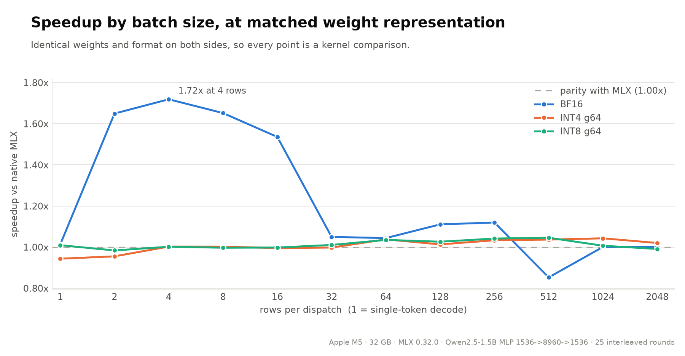
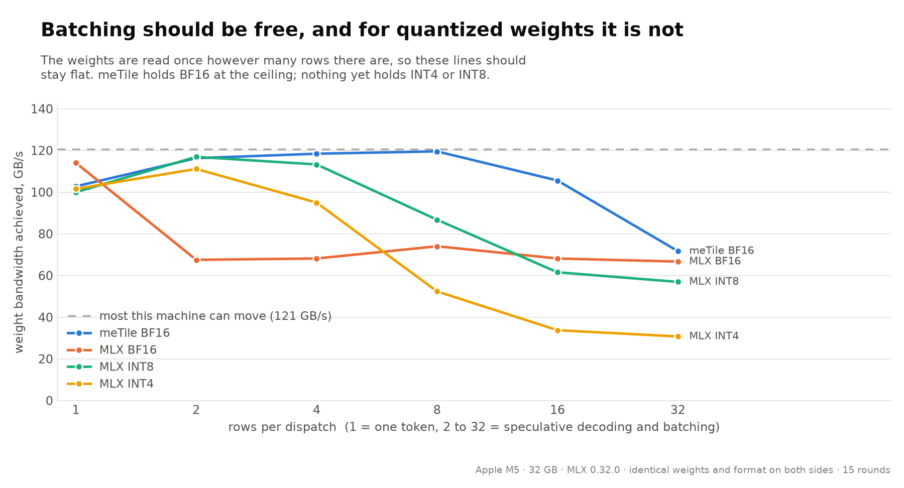
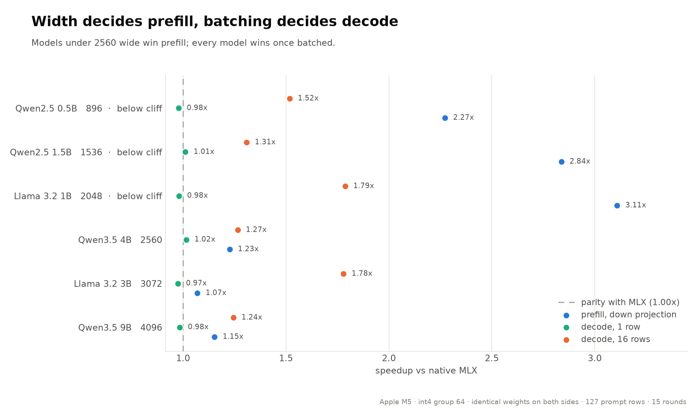
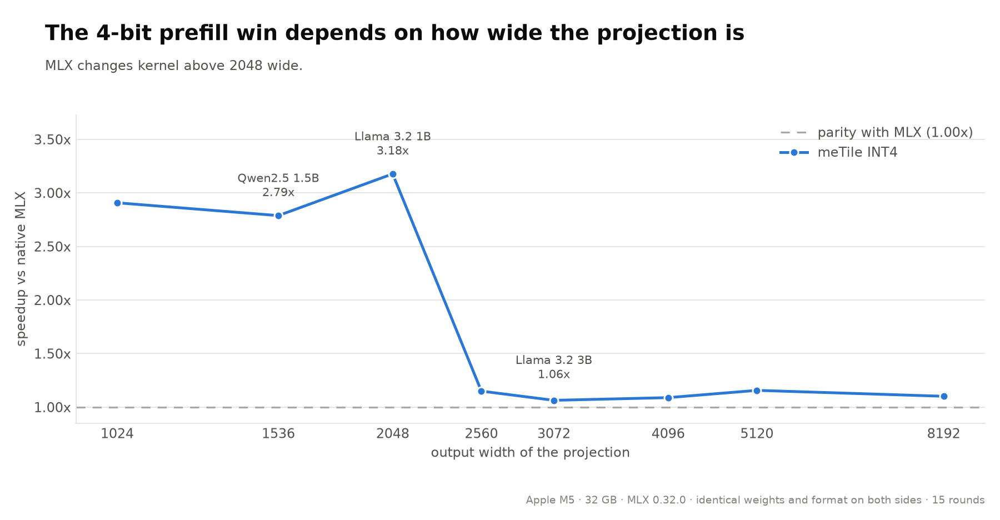
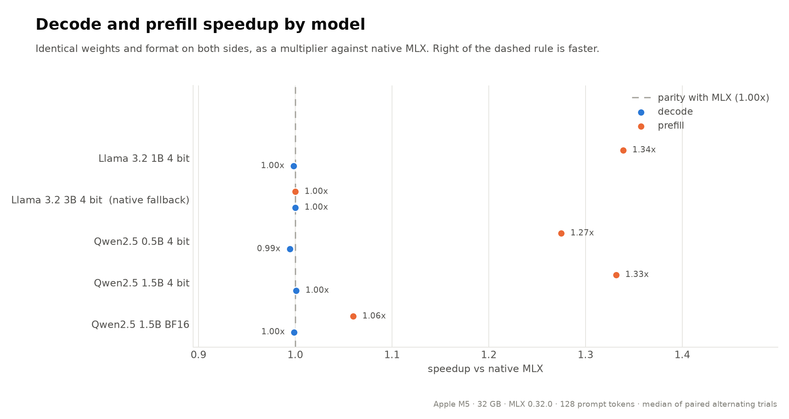
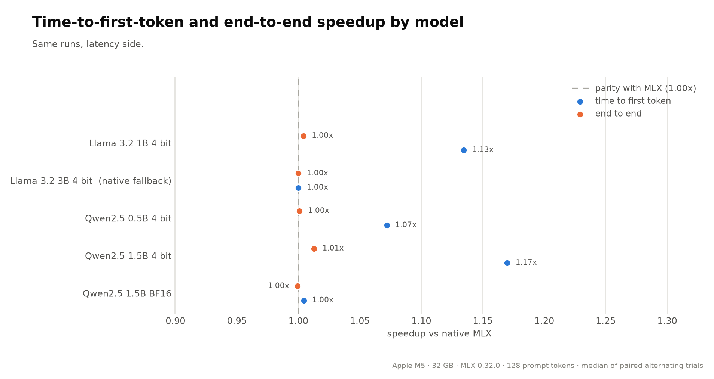

# meTile

Write GPU kernels in Python, get Metal. Runs on Apple silicon, and plugs into MLX.

```python
@metile.kernel
def softmax(X, Out, N, BLOCK: metile.constexpr):
    row = metile.program_id(0)

    m = -1e38
    for i in metile.tile_range(0, N, BLOCK):
        cols = i + metile.arange(0, BLOCK)
        x = metile.load(X + row * N + cols, mask=cols < N)
        m = metile.maximum(m, x)
    m = metile.max(m)

    s = 0.0
    for i in metile.tile_range(0, N, BLOCK):
        cols = i + metile.arange(0, BLOCK)
        x = metile.load(X + row * N + cols, mask=cols < N)
        s = s + metile.exp(x - m)
    s = metile.sum(s)

    for i in metile.tile_range(0, N, BLOCK):
        cols = i + metile.arange(0, BLOCK)
        x = metile.load(X + row * N + cols, mask=cols < N)
        metile.store(Out + row * N + cols, metile.exp(x - m) / s, mask=cols < N)
```

You write the obvious three passes. The compiler notices the first two can be merged into
one and rewrites them. That reads the input twice instead of three times and runs 1.28x
faster, but only after checking that the merge is algebraically valid.

## Speed

Everything below runs on one **Apple M5 (32 GB, MLX 0.32.0)** and compares meTile against
MLX **using the same weights in the same format on both sides**, so a speedup is a faster
kernel, not a change in numeric precision. `1.00x` means the same speed as MLX.

### Small batches are where meTile wins

MLX slows down sharply once you feed it more than one row at a time. meTile doesn't. This
is the range a speculative-decoding verification pass runs in.

| rows per dispatch | 1 | 2 | 4 | 8 | 16 | 32 | 128 |
|---|---|---|---|---|---|---|---|
| **BF16** | 1.02x | **1.69x** | **1.82x** | **1.65x** | **1.52x** | 1.06x | 1.11x |
| **INT4** | 1.02x | 1.02x | 1.02x | **1.29x** | **1.31x** | **1.23x** | 1.00x |
| INT8 | 0.98x | 0.99x | 1.00x | 1.00x | 1.00x | 1.00x | 1.00x |

The BF16 results are **bit-identical** to running those rows through MLX one at a time, so
batching changes the speed and nothing else.

INT8 sits at parity because meTile has no kernel of its own there and calls MLX's, so that
row describes both backends.



Why it happens: every row in a batch reads the same weights, so feeding in more rows should
not cost more weight traffic. MLX re-reads them per row tile and meTile does not, which is
the gap between each pair of lines below. Both sides still slope down past eight rows, but
that part is not waste: the same weights are serving eight to thirty-two times the
arithmetic by then.



Single-row decode is a different story and has no headroom at all. MLX runs it at 93 to 97%
of what a bare streaming read can move, and a hand-written kernel matches it without beating
it, so the 1.02x above is the whole of what is there.

### Whole models

| Model | Decode | Prefill |
|---|---|---|
| Llama 3.2 1B 4-bit | 1.00x | **1.34x** |
| Qwen 2.5 0.5B 4-bit | 0.99x | **1.27x** |
| Qwen 2.5 1.5B 4-bit | 1.00x | **1.33x** |
| Qwen 2.5 1.5B BF16 | 1.00x | 1.06x |
| Qwen 3.5 4B 4-bit | 1.00x | 1.00x |
| Qwen 3.5 9B 4-bit | 1.00x | 1.00x |

Those last two are worth reading carefully. A flat 1.00x looks like "nothing here", and it
is not: it means nothing was available at the one shape this harness exercises. Measure the
same models at their own layer shapes and both of them gain once you feed in more than one
row:



Every model is near parity at one row, because that is bandwidth bound and there is nothing
to win. Every model gains at sixteen rows, because the weights get reused. Only prefill
depends on the model, and it depends on exactly one thing:



MLX switches kernel somewhere between output widths 2048 and 2560, and the one it uses below
that is poor. A model wins if its layers are narrow enough to land in that band. Llama 3.2 1B
has a 2048-wide down projection and gets 3.16x; Llama 3.2 3B has a 3072-wide one and gets
1.06x. Depth is irrelevant, since it multiplies both sides equally.

At the wider shapes we are already at **97% of the fastest matmul this machine can run**, so
there is nothing left to win there rather than something we have not got to yet.





### Individual kernels

| | Speedup |
|---|---|
| Attention, 1 query over 1024 keys | **1.29x** |
| Attention, 512 queries, causal | 1.00x |
| Residual add + RMSNorm, 512 x 4096 | **1.21x** |
| Residual add + RMSNorm, decode sized | 1.00x |

### Where meTile is *not* faster

- **Single-token decode: about the same as MLX.** Generating one token at a time is limited
  by memory speed, not by the kernel. A bare streaming-read kernel tops out at 121 GB/s on
  this machine and MLX already runs at 93 to 97% of that, so there is almost nothing left to
  win. Batching is what moves this number, which is why the table above starts at 1 and climbs.
- **INT8: about the same as MLX.** meTile has no kernel of its own there and steps aside
  rather than forcing one. INT4 used to say the same and no longer does above four rows.
- **Softmax: 0.74x to 0.99x.** MLX's is already a single fused kernel.

### Trading accuracy for speed

meTile can also store parts of a BF16 model as INT8 and decode **1.37x to 1.75x** faster.
This is *not* the comparison above. It is faster because it reads fewer bytes, not because
the kernel is better.

```python
import mlx.core as mx
from mlx_lm import load
from metile.integrations.mlx_lm import (
    apply_metile_to_mlx_lm,
    autotune_metile_for_mlx_lm,
    prepare_mlx_lm_compressed_attention,
    prepare_mlx_lm_compressed_down,
    prepare_mlx_lm_compressed_gate_up,
    prepare_mlx_lm_compressed_vocab,
)

model, tokenizer = load("mlx-community/Qwen2.5-1.5B-Instruct-bf16")

# Store these projections as INT8. The BF16 weights are kept, and any layer that
# fails the accuracy check keeps using them.
compressed = {
    "compressed_down": prepare_mlx_lm_compressed_down(model, format="affine8"),
    "compressed_gate_up": prepare_mlx_lm_compressed_gate_up(model),
    "compressed_attention": prepare_mlx_lm_compressed_attention(model),
    "compressed_vocab": prepare_mlx_lm_compressed_vocab(model),
}

# Time each combination on the real model and keep whatever actually wins.
sample = mx.array([tokenizer.encode("Explain tiled matrix multiplication.")])
plan = autotune_metile_for_mlx_lm(model, sample, quantized_mlp=False, **compressed)

with apply_metile_to_mlx_lm(model=model, plan=plan, **compressed):
    ...  # generate as usual

# Leaving the block restores every patched function.
```

Only single-token decode is affected. Prefill stays in BF16. A layer is compressed only if
the next token is unchanged and the logit error stays inside a fixed bound, so layers that
are sensitive to quantization keep their original weights. Group sizes are picked by
measurement. Details in the [MLX backend guide](docs/guide/mlx-backend.rst).

## Install

```bash
pip install -e ".[dev]"

pip install -e ".[mlx-lm]"       # MLX integration
pip install -e ".[benchmarks]"   # chart renderer
```

## Tests and benchmarks

```bash
make test                                      # everything
python -m pytest tests/test_gemm.py -v         # one file

make bench                                     # everything
python benchmarks/matched_representation_matrix.py   # the batch-size table above
python benchmarks/model_shape_matrix.py              # each model at its own layer shapes
python benchmarks/shape_sensitivity.py               # the two shape charts above
python benchmarks/graph_fusion_speedup.py            # the kernel table above
python benchmarks/compile_comparison.py              # meTile vs mx.compile
```

## Documentation

| | |
|---|---|
| [Language](docs/guide/language.rst) | Writing kernels |
| [Tile operations](docs/guide/tile-ops.rst) | The op set |
| [Memory](docs/guide/memory.rst) | Layouts and address spaces |
| [Autotuning](docs/guide/autotuning.rst) | How schedules get picked |
| [Graph fusion](docs/guide/graph-fusion.rst) | Fusing across operations |
| [MLX backend](docs/guide/mlx-backend.rst) | Using meTile from MLX, and the full benchmark tables |
| [Architecture](docs/guide/architecture.rst) | How the compiler is put together |

## Links

- [Contributing](.github/CONTRIBUTING.md)
- [Performance Dashboard](https://andreslavescu.github.io/meTile/dev/bench/)

## Citations

The layout algebra follows CuTe, and the kernel language follows Triton.

Choosing which rewrites to apply is a max-flow problem here. Overlapping candidates cannot
both be applied, so picking the best set is maximum-weight independent set, which reduces to
an exact s-t min-cut. Two sources that led to that idea framing. PyTorch solves a different compiler
problem the same way, using min-cut to decide which activations to save versus recompute. When studying CS 341,
Lap Chi Lau's notes introduce the reduction itself, including the project selection
problem, which is the shape the selector actually uses. After taking his class (Spring 2025), it insighted this direction of thought.

```bibtex
@misc{he2022mincut,
    title={Min-cut optimal(*) recomputation (i.e. activation checkpointing) with AOTAutograd},
    author={Horace He},
    year={2022},
    howpublished={PyTorch Dev Discussions},
    url={https://dev-discuss.pytorch.org/t/min-cut-optimal-recomputation-i-e-activation-checkpointing-with-aotautograd/467}
}

@misc{lau2025cs341,
    title={CS 341: Algorithms, Lectures 15 and 16: Maximum Flow, Minimum Cut, and Applications},
    author={Lap Chi Lau},
    year={2025},
    howpublished={University of Waterloo course notes},
    url={https://cs.uwaterloo.ca/~lapchi/cs341-2025/notes.html}
}

@misc{cecka2026cute,
    title={CuTe Layout Representation and Algebra},
    author={Cris Cecka},
    year={2026},
    eprint={2603.02298},
    archivePrefix={arXiv},
    primaryClass={cs.MS},
    url={https://arxiv.org/abs/2603.02298}
}

@inproceedings{tillet2019triton,
    title={Triton: An Intermediate Language and Compiler for Tiled Neural Network Computations},
    author={Philippe Tillet and H. T. Kung and David Cox},
    booktitle={Proceedings of the 3rd ACM SIGPLAN International Workshop on Machine Learning and Programming Languages},
    year={2019},
    doi={10.1145/3315508.3329973}
}
```

## License

MIT
