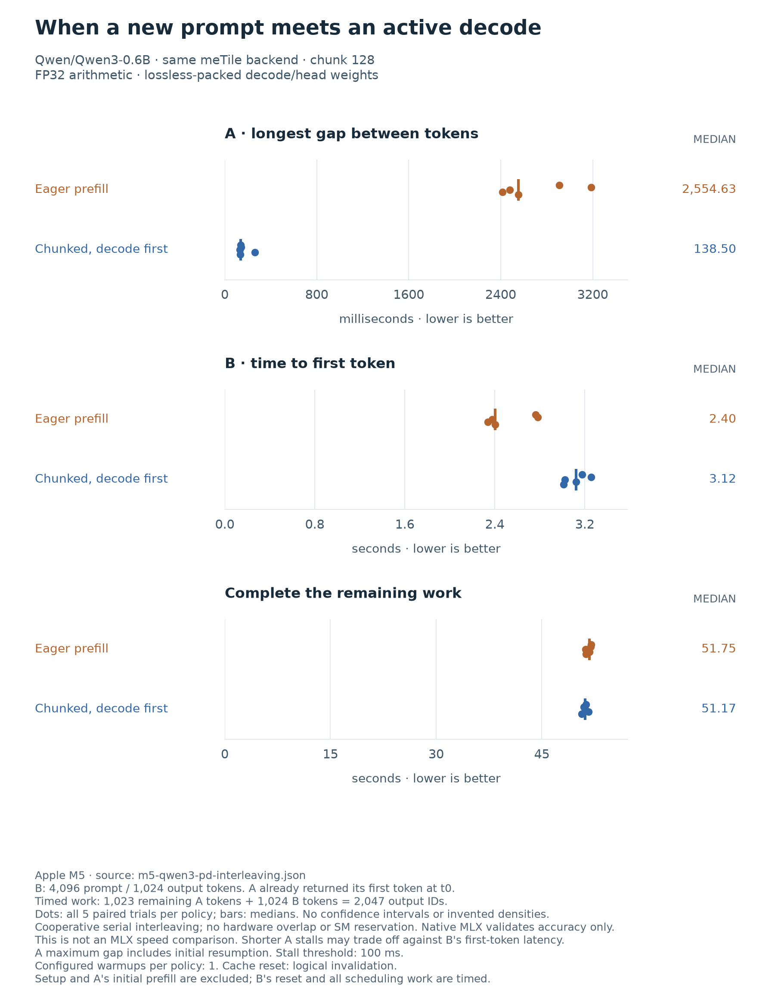

Prefill/decode scheduling
==========================

A long prompt should not stop an unrelated request from producing its next
token. This prototype gives ready decodes a turn between bounded prefill
chunks. It changes scheduling, not the model's attention or numerical
precision. The model arithmetic remains in DSL kernels.

What this can and cannot do
----------------------------

`CUDA green contexts
<https://docs.nvidia.com/cuda/cuda-programming-guide/04-special-topics/green-contexts.html>`_
can assign work to provisioned SM subsets. The inspected public Metal APIs in
the macOS 26.2 SDK do not expose an equivalent compute-core reservation or
affinity control. Metal supports `concurrent compute dispatch
<https://developer.apple.com/documentation/metal/mtldispatchtype/concurrent>`_,
but concurrency is not a core partition or a latency guarantee. Apple also
describes `interleaving independent compute work
<https://developer.apple.com/videos/play/wwdc2022/10159/>`_ to improve GPU use.

The current implementation uses **cooperative, serial interleaving** on one
GPU. A prefill chunk completes before the next decode runs; it does not
preempt an executing kernel, reserve cores, overlap kernels, transfer KV
between devices, or implement hardware prefill/decode disaggregation.

The requests must be independent. A request cannot generate its own first
output before its prompt has been processed. This experiment therefore
measures mixed-request responsiveness and throughput, not a faster isolated
prefill algorithm or an MLX speedup. Shorter prefill quanta can reduce decode
blocking while delaying the new request's first token or increasing total
workload time.

Independent state, shared weights
----------------------------------

The :download:`chunked adapter
<../../benchmarks/megakernels/qwen3_prefill_runtime.py>` provides two building
blocks:

* ``prepared.fork_request().prepare()`` creates an empty request with its own
  KV cache, controls, activations, logits, argmax scratch and dispatch bindings.
  It shares the finalized original weights, packed decode weights, prefill
  weight views and rotary table. The configuration and weight-view dictionaries
  are copied. Shared buffers are read-only by caller contract, not protected
  against arbitrary host mutation.
* ``prefill_chunk(tokens, final_chunk=...)`` submits at most ``chunk_size``
  tokens. A nonfinal chunk updates every layer's KV cache but skips unused
  final-layer output work. Only the true final chunk retains the activations
  needed by ``project_last_prefill()``. Projection after a cache-only chunk is
  rejected.

The existing ``prefill(tokens)`` method retains its behavior and uses the same
chunk operation internally. Forking requires a fully prepared source; the
new request must then be prepared separately. Neither operation makes the
stateful adapters thread-safe. The benchmark has one scheduling owner and
observes completion before reusing each request's controls.

``reset(clear_cache=False)`` optionally invalidates the logical cache length
without rewriting physical K/V storage. Newly valid positions are overwritten
before attention can read them, and future positions remain outside the live
prefix. The existing synchronized control updates still protect pending GPU
work. The default ``reset()`` continues to clear the cache. Logical reset
retains prior data in memory: it is not data erasure, and callers must not
interpret entries beyond ``cached_tokens`` as valid. The benchmark's explicit
``--logical-cache-reset`` flag applies this policy to every compared schedule.

Fixed-arrival experiment
-------------------------

Both requests use Qwen3-0.6B and distinct, hashed technical-document prompts.
Each has 4,096 input tokens and exactly 1,024 greedy output tokens. Request A
has completed prefill and returned its first token before timing. At time
zero, A is ready for its next decode and request B arrives.

.. list-table:: Policies execute the same kernels and token work
   :header-rows: 1
   :widths: 20 80

   * - Policy
     - Scheduling rule
   * - Eager
     - Finish B's entire prefill, then alternate ready A/B decodes.
   * - Chunked
     - Run one decode per ready request, then at most one B prefill chunk.
   * - FIFO, optional
     - Finish A, then prefill and generate B.

All policies use the same chunk size and final-layer pruning. The default
chunk size is 128; there is no hidden tuning sweep. Timing includes B's cache
reset, scheduler and control work, GPU execution, greedy selection and host
token observation. A's prefill and first output are excluded, as are loading,
packing, compilation and persistent allocation.

There are **2,047 timed outputs**, not 2,048: A has 1,023 remaining outputs and
B has 1,024. Aggregate throughput uses that count divided by the makespan.
A's recorded completion latency is its remaining service time, not its full
request latency. B's time to first token starts at its fixed time-zero arrival.

The report retains each token ID, emission timestamp and scheduling event.
It reports inter-token p50/p95/p99, the maximum gap, A's initial resumption
gap, and intervals intersecting B's prefill and service. A preset 100 ms
threshold defines a descriptive stall count and excess duration, not a GPU
stall counter. A single long pause can disappear from a p95 summary, so the
maximum gap matters. Within-request intervals are not independent trials.

Before any timings, every policy checks both trajectories against the
unmodified FP32 MLX model with TF32 disabled: complete K/V prefixes at chunk
boundaries, every output's full-vocabulary logits and exact token, every new
K/V slot, and periodic full-cache checkpoints. The fixed combined relative
and absolute tolerances remain 0.001. Every warmup and timed token sequence
must match its validated reference. MLX is an accuracy reference here, not a
timed policy.

Measured on Apple M5
--------------------

Five paired trials used Qwen3-0.6B, two independent 4,096-token prompts,
1,024 outputs per request, 128-token chunks and logical cache reset. Each
policy had one warmup; trial order alternated. Both policies used the same
FP32 arithmetic and losslessly packed decode weights. Every accuracy gate
passed, and all timed token sequences matched the native reference.

.. list-table:: Medians across five trials; lower latency is better
   :header-rows: 1
   :widths: 52 24 24

   * - Metric
     - Eager
     - Chunked
   * - A's maximum inter-token gap
     - 2,554.6 ms
     - 138.5 ms
   * - A's initial resumption gap
     - 2,554.6 ms
     - 33.8 ms
   * - A's p95 inter-token gap
     - 54.0 ms
     - 58.2 ms
   * - A's p99 inter-token gap
     - 60.4 ms
     - 109.4 ms
   * - B's time to first token
     - 2.404 s
     - 3.122 s
   * - Mixed-workload makespan
     - 51.752 s
     - 51.167 s
   * - Aggregate timed output rate
     - 39.55 tokens/s
     - 40.01 tokens/s

Chunking replaces one multi-second interruption with repeated shorter gaps.
The median paired reduction in A's maximum gap is **19.09x**, but this is not
a throughput speedup or a latency guarantee. Across the five chunked runs,
the maximum gap ranged from 130.8 to 262.2 ms. The largest occurred during
alternating decode, well after B finished prefill; limiting prefill chunks
does not bound every token gap. A's p95 and p99 got worse, and the median
count of gaps above 100 ms rose from 1 to 14. The median summed duration
above that threshold fell from 2.455 to 0.248 seconds.

B waits longer for its first token because A keeps receiving decode turns.
Total workload time stays close: the median paired makespan ratio is just
1.013x in favor of chunking. Five repetitions of this fixed workload do not
establish a general throughput improvement, serving capacity or tail-latency
bound. This is a responsiveness tradeoff, not an isolated prefill win.

   Each dot is one trial; the line marks its policy's median. The comparison
   changes only scheduling, not the backend. It does not measure GPU overlap.

The :download:`raw report
<../../benchmarks/results/m5-qwen3-pd-interleaving.json>` includes all token
timestamps, validation checks, scheduling events and source hashes. Rebuild
the figure with ``python -m benchmarks.plots.render_pd_interleaving``.

Reproduce
---------

.. code-block:: bash

   MLX_ENABLE_TF32=0 python -m benchmarks.megakernels.qwen3_pd_interleaving \
     --prompt-tokens 4096 --output-tokens 1024 --chunk-size 128 \
     --policies eager chunked --trials 5 --warmups 1 --logical-cache-reset \
     --output /tmp/qwen3-pd-interleaving.json

The model must already be available in the local Hugging Face cache. Existing
report paths are never overwritten. Add ``fifo`` to ``--policies`` to include
the request-FIFO reference. ``--no-lossless-decode-weights`` disables packing
for every compared policy. Shorter runs are diagnostics, not evidence for the
4,096-input/1,024-output workload.
